<table>
<tr>
<td valign="top"></td>
<td valign="top"></td>
</tr>
</table>

## Vishal Kumar

**MERN Developer · AI Developer**

 

<!-- animated contribution graph, refreshed daily by the workflow -->

---

